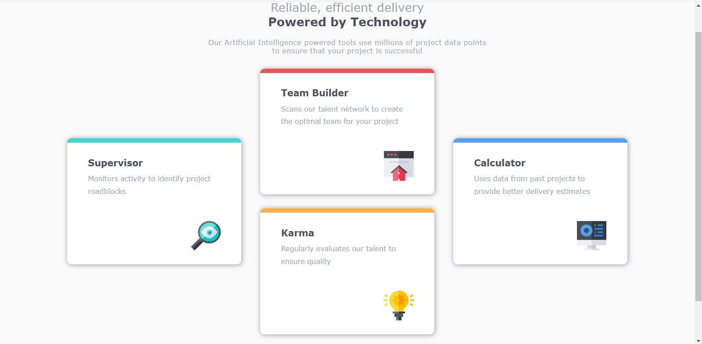

# Frontend Mentor - Four card feature section solution

This is a solution to the [Four card feature section challenge on Frontend Mentor](https://www.frontendmentor.io/challenges/four-card-feature-section-weK1eFYK). Frontend Mentor challenges help you improve your coding skills by building realistic projects.

## Table of contents

-   [Overview](#overview)
    -   [The challenge](#the-challenge)
    -   [Screenshot](#screenshot)
    -   [Links](#links)
    -   [Built with](#built-with)
    -   [What I learned](#what-i-learned)
    -   [Continued development](#continued-development)
-   [Author](#author)

**Note: Delete this note and update the table of contents based on what sections you keep.**

## Overview

The challenge was to build out this feature section and get it looking as close to the design as possible.

I made use of HTML, CSS, Flexbox and it is responsive on all screen sizes.

### The challenge

Users should be able to:

-   View the optimal layout for the site depending on their device's screen size

### Screenshot



### Links

-   Solution URL: [Add solution URL here](https://github.com/ChinonsoVincent/Frontend-Mentor-Four-card-feature-section)
-   Live Site URL: [Add live site URL here](https://github.com/ChinonsoVincent/Frontend-Mentor-Four-card-feature-section/commits/main)

### Built with

-   Semantic HTML5 markup
-   CSS custom properties
-   Flexbox
-   Mobile-first workflow

**Note: These are just examples. Delete this note and replace the list above with your own choices**

### What I learned

I learned how to properkly use google fonts and link them using the @@import url()

```css
@import url("https://fonts.google.com/specimen/Poppins");
```

### Continued development

I would like to learn how to use grid and improve on it as it gave me hard time using here.

## Author

-   Linkedin - [Vincent Chinonso Nwafili](www.linkedin.com/in/vincent-chinonso-nwafili-b96ba9197)
-   Twitter - [@nwafili\_](https://www.twitter.com/nwafili_)
-   Frontend Mentor - [@ChinonsoVincent](https://www.frontendmentor.io/profile/@ChinonsoVincent)
